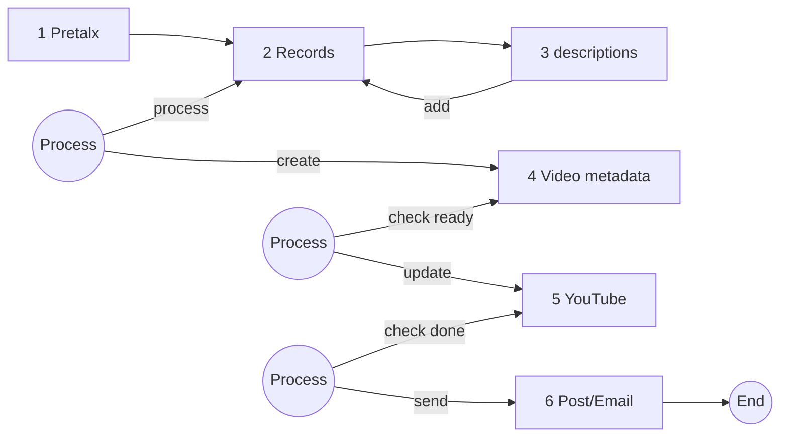

# Release Conference Videos on YouTube

Manage and release conference videos on YouTube using the talk and speaker infos
in [Pretalx](https://github.com/pretalx/pretalx)

## Main Features

* Manage the release of videos on YouTube:
    * Video descriptions
    * Publishing date
    * Monitoring of the release status and triggering of Social Media posts
    * Management of videos in multiple channels
* Create descriptions based on the data in Pretalx with NLP
* Create and post Social Media posts
* Email notifications to speakers

---

## High level process overview

1. Involve your video recording team from the very start
2. Upload videos to YouTube
3. Collect data from Pretalx, store local JSON files `records`
4. Add descriptions to `records` via Natural Language Processing (NLP).`
5. Process `records` to `video metadata` incl. publishing date, store in directory `video_records`
6. Update videos via API on YouTube with `video metadata`: move to `video_records_updated`
7. Confirm recently published videos: move to `video_published` and create Social Media posts and Email notifications
8. Send out Social Media posts and Emails

⚠️ **Note**: You need to follow a few conventions to make everything work seamlessly.
Best familiarize yourself with the process upfront.
---

### Simplified graph of the process

## Conventions

For file naming, always use the Pretix-ID is used.

For each status a separate directory is used. Move the files to the next status directory after successful processing.

## Preparations

Involve your video recording team from the very start.
It's a best practice to have a production plan.

The current implementation provides an interface to Google Sheets
to get data from a production plan shared on Google Drive.
The production plan must include information for linking the video recording files to the Pretalx Id.

Upload videos to YouTube, [for instructions details see here](youtube.md).

### Configration

There is a general configuration file `config.yaml` that provides the general structure.

Individual configurations are stored in the local file `config_local.yaml` which must never be shared:

* Storage locations
* Pretalx
    * Event information
    * Custom assignments of Pretalx ID to a release channel (e.g., PyCon DE / PyData)
* YouTube
    * credentials
    * channels
* OpenAI: credentials
* Other:
    * Vimeo API access (optional)
    * Google Spreadsheets (optional). Often used for managing custom information like opt-outs.

!!! note
    Pretalx access is provided via `pythanis` which stores the credentials in a separate local file

### Credentials for Pythanis

Pretalx is used to interact with:

1. Pretalx
2. Google Spreadsheets
3. Helpdesk (to send Emails)

[See here](https://florianwilhelm.info/pytanis/latest/usage/installation/#retrieving-the-credentials-and-tokens)
how to add credentials.

## Limitations

Currently, a local storage is required for storage of metadata and managing the release status.  
A future version should support a shared space or document database.

Sending Emails is currently only supported via the Helpdesk API.  
Other ways to send emails should be supported in the future.

## Realization

[Pioneers Hub](https://www.pioneershub.org/en/) helps to build and maintain thriving communities of experts in tech and
research to share knowledge, collaborate and innovate together.
{: style="width:50%"}