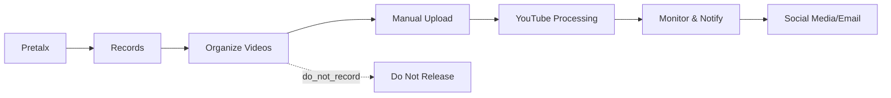
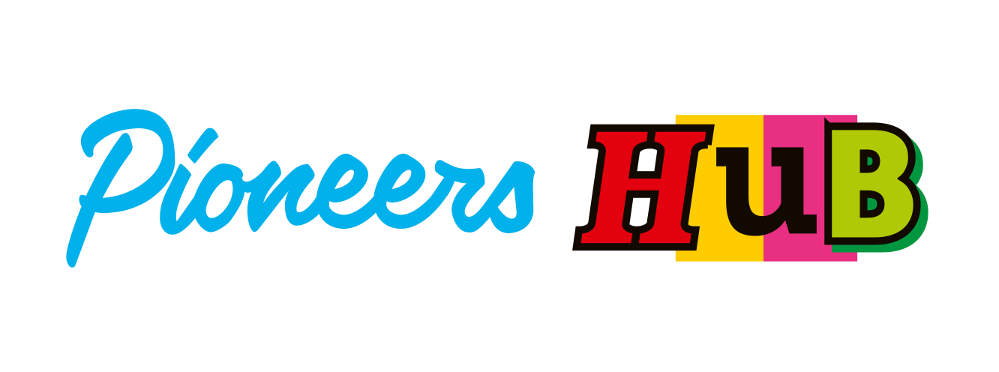

# Release Conference Videos on YouTube

Manage and release conference videos on YouTube using the talk and speaker infos
in [Pretalx](https://github.com/pretalx/pretalx)

## Main Features

* **Video Management on YouTube:**
    * Automated video descriptions from Pretalx data
    * Scheduled publishing dates
    * Multi-channel support for different tracks
    * Release status monitoring

* **AI-Powered Content Generation:**
    * Support for multiple AI providers: OpenAI (GPT-3.5/4), Anthropic Claude, Google Gemini, Cohere
    * Automated teaser and description generation
    * Configurable temperature settings for creativity control

* **Multi-Platform Social Media:**
    * Post to LinkedIn, Twitter/X, Mastodon, or Bluesky
    * Platform-specific formatting (character limits)
    * Automated posting when videos go live

* **Additional Features:**
    * Email notifications to speakers
    * Event-based directory structure for multi-conference support
    * AI-friendly CLI with structured JSON responses
    * Comprehensive setup wizard

---

## High level process overview

1. **Pre-Production**: Coordinate with video team, establish naming conventions
2. **Data Collection**: Fetch session/speaker data from Pretalx (`pytube records fetch`)
3. **Video Organization**: Assign videos to channels and organize files (`pytube video assign-channels` + `move`)
4. **Upload**: Manually upload videos to YouTube (maintaining filename as title)
5. **Processing**: Map videos and update metadata (`pytube youtube map` + `update` + `schedule`)
6. **Automation**: Monitor publications and send notifications (`pytube notify check --auto-post`)

⚠️ **Note**: Video files must include the Pretalx session ID (e.g., `ABC123-title.mp4`)
---

### Simplified graph of the process

``` mermaid
graph LR;
    P[Pretalx] --> R[Records]
    R --> O[Organize Videos]
    O --> U[Manual Upload]
    U --> Y[YouTube Processing]
    Y --> M[Monitor & Notify]
    M --> S[Social Media/Email]
    
    O -.->|do_not_record| DNR[Do Not Release]
```

## Conventions

- **Video files**: Must include the Pretalx session ID at the start (e.g., `ABC123-title.mp4`)
- **Status tracking**: JSON files move between directories to track progress
- **Channel assignment**: Based on track patterns, with special handling for `do_not_record` sessions

## Preparations

Involve your video recording team from the very start.
It's a best practice to have a production plan.

The current implementation provides an interface to Google Sheets
to get data from a production plan shared on Google Drive.
The production plan must include information for linking the video recording files to the Pretalx Id.

Upload videos to YouTube, [for instructions details see here](youtube.md).

### Configuration

There is a general configuration file `config.yaml` that provides the general structure.

Individual configurations are stored in the local file `config_local.yaml` which must never be shared:

* **Storage locations** - Working directories and video paths
* **Pretalx** - Event slug and API credentials
* **AI Service Selection** - Choose between OpenAI, Anthropic, Google, or Cohere
* **Social Media Platform** - Select LinkedIn, Twitter/X, Mastodon, or Bluesky
* **API Credentials** - Keys and tokens for all services

For detailed setup instructions, see:
- [API Credentials Guide](api-credentials.md) - Step-by-step instructions for obtaining API keys
- [Quick Setup Guide](quick-setup-services.md) - Fastest path to get started
- [Step-by-Step Guide](step-by-step.md) - Complete workflow walkthrough

!!! note
    Pretalx access is provided via `pythanis` which stores the credentials in a separate local file

### Credentials for Pythanis

Pretalx is used to interact with:

1. Pretalx
2. Google Spreadsheets
3. Helpdesk (to send Emails)

[See here](https://florianwilhelm.info/pytanis/latest/usage/installation/#retrieving-the-credentials-and-tokens)
how to add credentials.

## Limitations

Currently, a local storage is required for storage of metadata and managing the release status.  
A future version should support a shared space or document database.

Sending Emails is currently only supported via the Helpdesk API.  
Other ways to send emails should be supported in the future.

## Realization

[Pioneers Hub](https://www.pioneershub.org/en/) helps to build and maintain thriving communities of experts in tech and
research to share knowledge, collaborate and innovate together.
{: style="width:50%"}