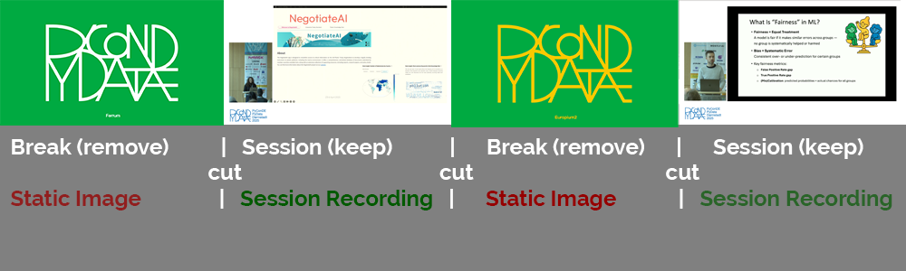

# Video Presentation Detector

A tool to automatically detect and extract presentations from videos of conferences, livestreams, or lectures that contain both presentations and break screens.



## Features

- Automatically detects transitions between break screens and presentations
- Supports batch processing of multiple videos
- Extracts presentations as separate video files
- Extracts audio from presentations as MP3 files
- Detailed output with timestamps and presentation durations
- Configurable via YAML configuration file

## Installation

1. **Create and activate a virtual environment:**

```bash
# Create a virtual environment
uv venv

# Activate it (Unix/MacOS)
source .venv/bin/activate

# Activate it (Windows)
.\.venv\Scripts\activate
```

2. **Install video processor dependencies:**

```bash
# Install with video processing dependencies
uv pip install ".[video_processor]"
```

3. **Install FFmpeg**: 
   FFmpeg is **required** for video and audio extraction. The tool will not work without it.

   ```bash
   # macOS (using Homebrew)
   brew install ffmpeg
   
   # Alternative for macOS (using MacPorts)
   sudo port install ffmpeg
   
   # Ubuntu/Debian
   sudo apt-get update
   sudo apt-get install ffmpeg
   
   # Fedora
   sudo dnf install ffmpeg
   
   # Arch Linux
   sudo pacman -S ffmpeg
   
   # Windows
   # Download from ffmpeg.org/download.html
   # Extract the files and add the bin folder to your PATH
   ```
   
   Verify installation with:
   ```bash
   ffmpeg -version
   ```

## Configuration

Configuration is stored in `config.yaml`. If not present, a default one will be created automatically.

Key configuration options:

```yaml
input:
  # Single video file path (leave empty to use folder)
  video_path: ""
  # Folder containing videos to batch process
  folder: "input_videos"
  # File extensions to process from input folder
  extensions: "mp4,mkv,avi,mov,webm"

video:
  # Whether to resize frames for processing (speeds up detection but reduces accuracy)
  enable_resize: false
  # If resize is enabled, dimensions to use (width, height)
  processing_size: [320, 180]

break_detection:
  # Directory for break screen images (leave empty for auto-detection)
  images_dir: ""
  # Similarity threshold for break screen detection (0-1)
  threshold: 0.92
  # Whether to auto-detect break screens if none provided
  auto_detect: true

output:
  # Base output folder for extracted presentations
  folder: "extracted_presentations"
  # Whether to extract detected presentations as separate files
  extract_presentations: true
  # Whether to extract audio from presentations as MP3
  extract_audio: true
  # Whether to save presentation metadata as JSON
  save_metadata: true
```

## Usage

### Basic Usage

#### Single Video Processing

```bash
python -m video_manager.presentation_detector path/to/video.mp4 --extract --audio
```

This will:
- Process the specified video
- Extract individual presentations as separate video files
- Extract audio from each presentation

#### Batch Processing

```bash
python -m video_manager.presentation_detector --input-folder path/to/videos --extract --audio
```

### Advanced Options

```
usage: python -m video_manager.presentation_detector [-h] [--config CONFIG] [--output OUTPUT]
                                                    [--break-images BREAK_IMAGES] [--extract]
                                                    [--audio] [--input-folder INPUT_FOLDER]
                                                    [video_path]

arguments:
  video_path                    Path to the video file to process
  --config, -c CONFIG           Path to custom config file
  --output, -o OUTPUT           Custom output folder for extracted presentations
  --break-images, -b IMAGES     Directory containing break screen images
  --extract, -e                 Extract presentations as separate files
  --audio, -a                   Extract audio from presentations as MP3
  --input-folder, -i FOLDER     Process all videos in specified folder
  -h, --help                    Show help message
```

### Example Commands

**Using custom break screen detection:**
```bash
python -m video_manager.presentation_detector video.mp4 --break-images path/to/break/images
```

**Using custom output location:**
```bash
python -m video_manager.presentation_detector video.mp4 --output path/to/output/folder
```

**Using a custom config file:**
```bash
python -m video_manager.presentation_detector --config path/to/custom/config.yaml
```

## How It Works in Detail

### 1. Frame Sampling and Analysis

The detector samples frames at regular intervals throughout the video (configurable sampling rate). For each frame:
- The frame is converted to grayscale and normalized
- Visual features are extracted using image processing techniques
- Frames are stored in memory for comparison

### 2. Break Screen Detection

Two methods are used for break screen detection:

**Method 1: Using Provided Break Images**
- If provided, the detector compares sampled frames against known break screen images
- Similarity is calculated using histogram comparison or structural similarity
- Frames that match above the similarity threshold are classified as break screens

**Method 2: Automatic Detection (when no break images are provided)**
- The detector clusters frames based on visual similarity
- Large clusters of similar frames are identified as potential break screens
- The most common frame clusters are selected as break screens

### 3. Transition Detection

Once break screens are identified, the detector:
- Uses binary search to pinpoint exact frame transitions (improves accuracy)
- Analyzes movement between adjacent frames to confirm transitions
- Handles edge cases like brief interruptions or camera shifts

### 4. Presentation Extraction

For each detected presentation segment:
- Start and end timestamps are precisely calculated
- Video is trimmed using FFmpeg with no re-encoding (when possible) for fast extraction
- Audio is extracted using FFmpeg's audio capabilities
- Metadata is generated including duration, timestamps, and filename

## Output Structure

For each processed video, a subdirectory is created in the output folder:

```
output_folder/
├── video1_name/
│   ├── presentations.txt       # Text file with presentation times
│   ├── video1_name_metadata.json   # JSON with detailed metadata
│   ├── video1_name_presentation_1.mp4  # First presentation video
│   ├── video1_name_presentation_1.mp3  # First presentation audio
│   ├── video1_name_presentation_2.mp4  # Second presentation video
│   └── video1_name_presentation_2.mp3  # Second presentation audio
├── video2_name/
│   └── ...
└── ...
```

## Best Practices

### Break Slide Recommendations

The effectiveness of presentation detection depends significantly on your break slides. Here are recommendations for good break slides:

| **Type** | **Good Examples**                                                                                                                            |
|---|----------------------------------------------------------------------------------------------------------------------------------------------|
| **Static Slides** | <br>✅ High contrast<br>✅ Consistent layout<br>✅ Solid color background                  |
| **Dynamic Slides** | <br>✅ Consistent elements<br>✅ Distinct from presentations<br>✅ Limited animation areas |

### Tips for Optimal Results

1. **Use distinctive break slides**
   - Choose break slides that are visually very different from presentation content
   - Solid colors or simple patterns work best
   - Avoid break slides that look like presentation slides

2. **Consistent break screens**
   - Use the same break screen throughout the recording
   - If multiple break screens are used, provide examples of each in the break-images folder

3. **Processing options**
   - For large videos, enable resizing to speed up processing
   - Adjust the similarity threshold if detection is too aggressive or too lax
   - Use custom break images for best results

4. **Handling problematic videos**
   - If auto-detection fails, extract a few frames of your break screens and use them as reference
   - For videos with quick transitions, adjust sampling rate in the config
   - Process in batches when dealing with many videos

## License

MIT