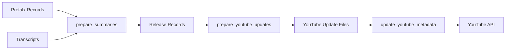

# AI Summary Generation Process

Comprehensive guide for generating AI-powered summaries from video transcripts using Claude API.

## Overview

The summary generation process creates rich, engaging descriptions for conference videos by analyzing:
- Session metadata (title, abstract, speaker bios)
- Video transcripts (speaker-attributed)
- Conference context

## Command

```bash
uv run python -m src.pipeline.prepare_summaries
```

---

## What Gets Generated

### For Each Video Session

**1. Long Summary** (400 words)
- Comprehensive technical overview
- Main topics and key insights
- Technologies and methodologies discussed
- Real-world applications and use cases
- Present tense, professional tone

**2. Short Summary** (200 words)
- Concise overview
- Core concepts
- Key takeaways
- Suitable for YouTube descriptions

**3. Social Media Teaser** (200 characters)
- Punchy, factual statement
- No promotional language
- What the talk covers (not "discover" or "learn")
- Designed for Twitter/LinkedIn

**4. Teaser Text** (1 sentence, 15-25 words)
- Compelling one-liner
- Captures talk's essence
- Present tense
- Used in YouTube description header

**5. Keywords & Tags**
- 10-15 diverse, specific keywords
- Technical terms, frameworks, tools
- Concepts and methodologies
- Industry-specific terms
- Used for YouTube tags

**6. Speaker Information**
- Speaker names (list)
- Extracted from session data

**7. Quotes** (Optional)
- 3 impactful quotes from transcript
- Technical insights or key statements

---

## Input Requirements

### 1. Pretalx Records
**Location**: `.work/{event_slug}/pretalx_records/`

**Required Fields**:
```json
{
  "code": "ABC123",
  "title": "Session Title",
  "abstract": "Brief description...",
  "description": "Full description...",
  "speakers": [
    {
      "name": "Speaker Name",
      "biography": "Speaker bio..."
    }
  ]
}
```

### 2. Transcripts
**Location**: `.work/transcripts/{session_code}/`

**Required File**: `transcript_attributed.txt`

**Format**:
```
[speaker_0]: The main concept we're discussing today is...
[speaker_1]: That's a great point about...
[speaker_0]: Let me demonstrate with this code example...
```

**Notes**:
- Multiple speakers labeled as `speaker_0`, `speaker_1`, etc.
- Main speaker typically has 70%+ of content
- Questions from audience usually at the end
- Talks vs Panels detected automatically

---

## Output Structure

### Release Records
**Location**: `.work/{event_slug}/release_records/{pretalx_id}.json`

**Structure**:
```json
{
  "pretalx_data": {
    "code": "ABC123",
    "title": "Session Title",
    "abstract": "...",
    "speakers": [...]
  },
  "media": {
    "youtube": {
      "youtube_id": "dQw4w9WgXcQ",
      "prepared_metadata": {
        "speakers": ["Name 1", "Name 2"],
        "recorded_date": "April 24, 2025",
        "youtube_metadata": {
          "category_id": 28,
          "privacy_status": "unlisted"
        }
      }
    }
  },
  "ai_summaries": {
    "speakers": ["Name 1", "Name 2"],
    "teaser_text": "One compelling sentence...",
    "long": {
      "text": "400-word comprehensive summary...",
      "word_count": 400,
      "keywords": ["keyword1", "keyword2", ...]
    },
    "short": {
      "text": "200-word concise summary...",
      "word_count": 200,
      "keywords": ["keyword1", "keyword2", ...]
    },
    "social": {
      "text": "200-character teaser...",
      "char_count": 200
    },
    "tags": ["Tag1", "Tag2", ...]
  },
  "quotes": [
    {
      "speaker": "speaker_0",
      "text": "Impactful quote from the talk...",
      "timestamp_context": "early/middle/late"
    }
  ],
  "summary_metadata": {
    "generated_at": "2025-10-05T10:00:00+00:00",
    "model": "claude-3-5-sonnet-20241022",
    "has_transcript": true,
    "transcript_length": 25000,
    "tokens_used": {
      "input": 22000,
      "output": 1200,
      "total": 23200
    },
    "all_keywords_mentioned": [...]
  }
}
```

---

## AI Prompts

### Long Summary Prompt
Generates 400-word technical overview with:
- Session context (title, abstract, speakers)
- Full transcript (or first 15,000 chars)
- Instructions for professional, present-tense summary
- Focus on technical content and real-world applications
- Returns JSON: `{"summary": "...", "teaser": "...", "keywords": [...]}`

### Short Summary Prompt
Generates 200-word concise version with:
- Same context as long summary
- Condensed key points
- Suitable for video descriptions
- Returns JSON: `{"summary": "...", "keywords": [...]}`

### Social Teaser Prompt
Generates 200-character factual statement:
- No promotional language
- States what the talk covers
- Present tense, professional
- Returns JSON: `{"text": "...", "char_count": 200}`

### Tags Prompt
Extracts diverse, specific keywords:
- Technical terms (FastAPI, PostgreSQL, RAG)
- Concepts (Machine Learning, Data Visualization)
- Methodologies (Agile, TDD)
- Industry terms (MLOps, DevOps)
- Returns JSON: `{"tags": [...]}`

### Quotes Extraction (Optional)
Selects 3 impactful quotes:
- Technical insights
- Key statements
- Memorable moments
- Returns JSON: `{"quotes": [...]}`

---

## Processing Logic

### Session Selection
1. Load all sessions from `pretalx_records/`
2. Check for existing `release_records/` (skip if exists)
3. Look for transcript in `.work/transcripts/{code}/`
4. Process if transcript exists, skip otherwise

### Transcript Analysis
**Talk Detection** (70%+ by one speaker):
- Identifies main speaker
- Focuses on their content
- Filters out Q&A at end

**Panel/Dialogue Detection** (multiple speakers):
- Considers all speakers equally
- Captures discussion dynamics
- Notes multiple perspectives

### Error Handling
- **No transcript**: Skips session, logs warning
- **API errors**: Retries with exponential backoff
- **JSON parse failures**: Falls back to raw text (with `strict=False`)
- **Rate limiting**: Automatic delays between API calls

### Cost Optimization
- Uses transcript preview (first 15k chars) when needed
- Batches related prompts
- Caches results (doesn't regenerate existing summaries)

---

## Configuration

### Environment Variables
```bash
export ANTHROPIC_API_KEY="sk-ant-..."
```

### Model Configuration
- **Model**: `claude-3-5-sonnet-20241022`
- **Max tokens**: 500-1500 per prompt
- **Temperature**: Default (balanced)

### Rate Limiting
- 1.5 second delay between API calls
- Respects Anthropic API limits
- Prevents 429 errors

---

## Cost Estimation

### Per Session
- **Input tokens**: ~20,000 (transcript + context)
- **Output tokens**: ~1,200 (summaries)
- **Cost**: ~$0.50-2.00 per session

### Full Conference (150 sessions)
- **Total cost**: $75-300
- **Time**: ~10-15 minutes (with rate limiting)

### Cost Breakdown (Claude 3.5 Sonnet)
- Input: $3 per million tokens
- Output: $15 per million tokens

---

## Post-Processing

### Fix JSON Parsing Issues

If summaries have JSON strings instead of plain text:

```bash
uv run python -m src.pipeline.fix_release_records_json
```

**What it fixes**:
- Extracts `summary` from JSON strings → `long.text`
- Extracts `teaser` from JSON strings → `teaser_text`
- Extracts `keywords` from JSON strings → `long.keywords`
- Uses `strict=False` for control character handling

**Results**:
- Fixed ~118 out of 159 records in test run
- Preserves original data
- Safe to re-run

---

## Quality Checks

### After Generation

```bash
# Check summary statistics
python3 << 'EOF'
import json
from pathlib import Path

records_dir = Path('.work/pyconde-pydata-2025/release_records')
total = 0
with_summaries = 0
with_teaser = 0

for f in records_dir.glob('*.json'):
    total += 1
    data = json.load(f.open())
    if data.get('ai_summaries', {}).get('long', {}).get('text'):
        with_summaries += 1
    if data.get('ai_summaries', {}).get('teaser_text'):
        with_teaser += 1

print(f"Total records: {total}")
print(f"With summaries: {with_summaries}")
print(f"With teaser: {with_teaser}")
EOF
```

### Validation
- Check for empty summaries
- Verify teaser text exists
- Confirm keywords present
- Review token usage

---

## Troubleshooting

### Empty Summaries
**Problem**: `long.text` is empty or JSON string
**Solution**: Run `fix_release_records_json.py`

### Missing Transcripts
**Problem**: Sessions skipped (no transcript)
**Solution**: Add transcripts to `.work/transcripts/{code}/`

### API Errors
**Problem**: 429 (rate limit) or 500 errors
**Solution**: Increase delay between calls (edit `prepare_summaries.py`)

### Control Character Errors
**Problem**: "Invalid control character" in JSON
**Solution**: `fix_release_records_json.py` handles this with `strict=False`

---

## Advanced Usage

### Regenerate Specific Sessions

```python
# Delete specific release records to regenerate
import os
os.remove('.work/pyconde-pydata-2025/release_records/ABC123.json')

# Re-run summary generation
# Will process only deleted records
```

### Custom Prompts

Edit prompts in `src/pipeline/prepare_summaries.py`:
- `prepare_long_summary_prompt()` - 400-word summary
- `prepare_short_summary_prompt()` - 200-word summary
- `prepare_social_teaser_prompt()` - Social media teaser
- `prepare_tags_prompt()` - Keyword extraction

---

## Best Practices

1. **Backup First**: Copy `pretalx_records/` before processing
2. **Start Small**: Test with 5-10 sessions first
3. **Monitor Costs**: Check Anthropic dashboard during processing
4. **Verify Quality**: Spot-check summaries for accuracy
5. **Save Logs**: Review `.logs/prepare_summaries_*.log` for issues
6. **Run Post-Processing**: Always run `fix_release_records_json.py` after

---

## Integration with YouTube Workflow



1. `prepare_summaries` creates `release_records/`
2. `prepare_youtube_updates` uses `release_records/` → creates `update/`
3. `update_youtube_metadata` sends `update/` → YouTube API

---

## See Also

- [README_youtube_workflow.md](README_youtube_workflow.md) - Complete YouTube update workflow
- [README_youtube_updates.md](README_youtube_updates.md) - YouTube update script details
