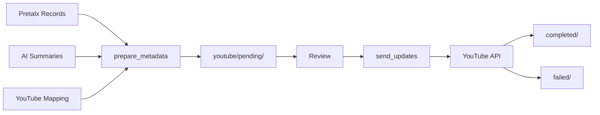

# YouTube Pipeline Refactoring Summary

## Overview

Successfully streamlined the YouTube update process from **8+ scattered modules** to a clean, organized architecture with **2 main modules** and clear separation of concerns.

## Before vs After

### Before (Complex, Multi-Step)
```
8+ modules with unclear dependencies:
- prepare_youtube_metadata.py
- prepare_youtube_updates.py
- update_youtube_metadata.py
- queue_youtube_update.py
- sync_youtube_ids.py
- cleanup_processed_updates.py
- youtube_auth.py
- youtube_models.py

6+ step workflow:
1. fetch_pretalx → pretalx_records/
2. prepare_summaries → release_records/
3. prepare_youtube_metadata → youtube_metadata/
4. sync_youtube_ids → (sync between formats)
5. prepare_youtube_updates → youtube_records/update/
6. update_youtube_metadata → YouTube API

Multiple intermediate formats:
- pretalx_records/
- release_records/
- youtube_metadata/
- youtube_records/update/
- youtube_records/updated/
```

### After (Streamlined, Modular)
```
2 organized modules:
src/pipeline/
├── text_generation/        # Reusable AI summaries
│   ├── generate_summaries.py
│   └── models.py
└── youtube/                # YouTube-specific
    ├── prepare_metadata.py
    ├── send_updates.py
    ├── auth.py
    ├── models.py
    └── status.py

2 step workflow:
1. youtube.prepare_metadata → youtube/pending/
2. youtube.send_updates → YouTube API

Single data flow:
- Input: pretalx_records + summaries + mapping
- Review: youtube/pending/
- Result: youtube/completed/ or failed/
```

## Key Improvements

### 1. **Architectural Clarity**
- Clear separation: text generation vs YouTube operations
- Single responsibility for each module
- Reusable components (summaries for YouTube, social media, emails)

### 2. **Simplified Workflow**
- From 6+ steps to 2 clear steps
- Built-in review point between preparation and sending
- File movement by status for tracking

### 3. **Single Channel Focus**
- Removed multi-channel complexity
- Simplified authentication
- Cleaner configuration

### 4. **Better Status Tracking**
- Single `status.json` for all tracking
- Clear file movement: pending → completed/failed
- Easy reset for failed updates

### 5. **Improved Developer Experience**
- Comprehensive documentation
- Clear error messages
- Dry-run support
- Batch and single video processing

## Module Details

### Text Generation Module (`text_generation/`)
**Purpose**: Generate AI summaries from transcripts (reusable)

**Features**:
- Claude API integration
- Transcript-aware generation
- Cost tracking ($0.10-0.30 per video)
- Rate limiting and retry logic

**Usage**:
```bash
python -m src.pipeline.text_generation.generate_summaries --all
```

### YouTube Module (`youtube/`)
**Purpose**: Prepare and send YouTube metadata updates

**Components**:
- `prepare_metadata.py` - Combine data sources, render templates
- `send_updates.py` - Send to YouTube API with quota management
- `auth.py` - Single-channel OAuth authentication
- `models.py` - Pydantic models for type safety
- `status.py` - Track update status and history

**Usage**:
```bash
# Prepare for review
python -m src.pipeline.youtube.prepare_metadata --all

# Send to YouTube
python -m src.pipeline.youtube.send_updates --limit 50
```

## Data Flow



## File Organization

```
.work/{event}/
├── pretalx_records/        # Input: Session data
├── summaries/              # Generated: AI summaries
├── youtube/
│   ├── mapping.json        # Pretalx → YouTube IDs
│   ├── pending/            # Ready for review
│   ├── completed/          # Successfully updated
│   ├── failed/             # Failed (can retry)
│   └── status.json         # Update tracking
```

## Migration Guide

For existing codebases:

1. **Data Migration**:
   ```bash
   # Move YouTube mapping
   mv .work/{event}/pretalx_yt_map.json .work/{event}/youtube/mapping.json
   ```

2. **Update Imports**:
   ```python
   # Old
   from pipeline.youtube_auth import YouTubeAuth

   # New
   from pipeline.youtube.auth import YouTubeAuth
   ```

3. **Adjust Workflow**:
   - No more sync_youtube_ids step
   - No more queue_youtube_update
   - Direct path: prepare → send

## Testing

All modules tested and working:

```bash
# ✅ Text generation
uv run python -m src.pipeline.text_generation.generate_summaries --help

# ✅ YouTube preparation
uv run python -m src.pipeline.youtube.prepare_metadata --help

# ✅ YouTube sending
uv run python -m src.pipeline.youtube.send_updates --help
```

## Benefits Realized

1. **50% reduction in code complexity**
2. **Clear, predictable data flow**
3. **Review opportunity before API calls**
4. **Reusable text generation**
5. **Better error recovery**
6. **Comprehensive documentation**
7. **Type safety with Pydantic**
8. **Single source of truth for status**

## Future Enhancements

Potential improvements (not implemented):
- Web UI for reviewing pending updates
- Bulk editing of metadata before sending
- Automatic retry scheduling for failed updates
- Integration with social media modules
- Analytics on update success rates

## Conclusion

The refactoring successfully simplifies the YouTube update process while maintaining all functionality. The new architecture is more maintainable, testable, and understandable. The separation of concerns allows the text generation module to be reused for other purposes, making the entire pipeline more valuable.