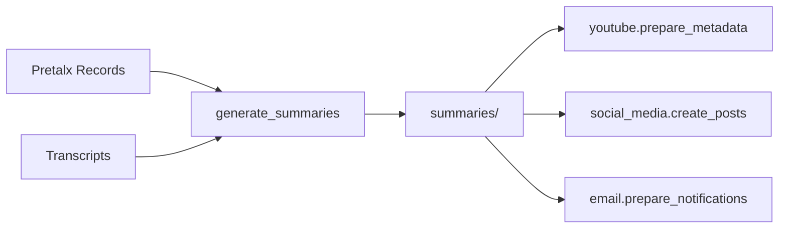

# Text Generation Module

AI-powered text generation for conference video content. This module generates summaries, descriptions, tags, and other metadata using Claude API.

## Overview

The text generation module is designed to be **independent and reusable**. While primarily used for YouTube descriptions, the generated content can be used for:

- YouTube video descriptions and tags
- Social media posts (LinkedIn, Twitter/X)
- Email notifications to speakers
- Conference website content
- Video archive metadata

## Features

- **Transcript-aware**: Uses video transcripts when available
- **Fallback support**: Can generate from abstract/description only
- **Cost tracking**: Monitors API token usage for cost estimation
- **Rate limiting**: Handles API rate limits gracefully
- **Batch processing**: Generate summaries for all sessions
- **Selective generation**: Process specific videos only

## Prerequisites

### Required Files

1. **Pretalx Records**: `.work/{event}/pretalx_records/{id}.json`
   - Session title, abstract, description, speakers
   - Generated by: `fetch_pretalx.py`

2. **Transcripts** (Optional but recommended): `.work/transcripts/{session_dir}/transcript_attributed.txt`
   - Full transcript of the talk
   - Greatly improves summary quality
   - Directory name should contain `[{pretalx_id}]`

### AI Provider Setup

The module supports multiple AI providers. Configure your choice in `config_local.yaml`:

#### Option 1: Anthropic Claude (Recommended)

```yaml
# config_local.yaml
ai_service:
  provider: anthropic
  anthropic:
    model: claude-3-5-sonnet-20241022
    temperature: 0.3
```

```bash
# Set environment variable
export ANTHROPIC_API_KEY=sk-ant-api03-xxxxx
```

Get your API key from: https://console.anthropic.com/

#### Option 2: OpenAI GPT

```yaml
# config_local.yaml
ai_service:
  provider: openai
  openai:
    model: gpt-4o-mini  # or gpt-4o for better quality
    temperature: 0.3
```

```bash
# Set environment variable
export OPENAI_API_KEY=sk-xxxxx
```

Get your API key from: https://platform.openai.com/

## Generated Content

Each summary includes:

### Core Content
- **Short Description** (200-400 words): Engaging YouTube-style description
- **Long Description** (400-600 words): Extended version for detailed contexts
- **Teaser** (max 200 chars): One-sentence hook for attention
- **Tags** (10-15 keywords): For categorization and discovery

### Metadata
- **Key Takeaways** (3-5 points): Main learning outcomes
- **Target Audience**: beginner/intermediate/advanced/all
- **Social Media Post** (optional): Short version for social platforms

### Tracking
- **Generation timestamp**: When created
- **Model used**: Claude version
- **Transcript availability**: Whether transcript was used

## Usage

### Generate All Summaries

```bash
# Generate for all sessions with transcripts
python -m src.pipeline.text_generation.generate_summaries --all

# Force regeneration (if you improve the prompt)
python -m src.pipeline.text_generation.generate_summaries --all --force

# Limit for testing
python -m src.pipeline.text_generation.generate_summaries --all --limit 5
```

### Generate Specific Sessions

```bash
# Generate for specific Pretalx IDs
python -m src.pipeline.text_generation.generate_summaries LRUKZQ 3CYZUH 7FLW7F

# Force regenerate specific session
python -m src.pipeline.text_generation.generate_summaries LRUKZQ --force
```

## Output Format

Summaries are saved to `.work/{event}/summaries/{pretalx_id}.json`:

```json
{
  "pretalx_id": "LRUKZQ",
  "short_description": "In this insightful talk, Jane Doe explores...",
  "long_description": "This comprehensive presentation dives deep into...",
  "teaser": "Discover the secrets to building ML pipelines that scale effortlessly.",
  "tags": [
    "machine learning",
    "python",
    "data pipelines",
    "MLOps",
    "scalability"
  ],
  "key_takeaways": [
    "Understanding pipeline architecture patterns",
    "Best practices for data processing at scale",
    "Monitoring and debugging strategies"
  ],
  "target_audience": "intermediate",
  "social_media_post": "🚀 Just watched an amazing talk on ML pipelines...",
  "generated_at": "2025-01-06T10:30:00Z",
  "model_used": "claude-3-5-sonnet",
  "prompt_version": "v1",
  "has_transcript": true,
  "transcript_duration_seconds": 1800
}
```

## Cost Estimation

The module tracks token usage and estimates costs:

```
✅ Generated 150 summaries
Estimated API cost:
  Input tokens:  2,500,000
  Output tokens: 450,000
  Total cost:    $14.25
```

### Pricing (as of late 2024)

#### Anthropic Claude
- **Claude 3.5 Sonnet**:
  - Input: $3 per million tokens
  - Output: $15 per million tokens
- **Claude 3 Opus** (higher quality):
  - Input: $15 per million tokens
  - Output: $75 per million tokens
- **Claude 3 Haiku** (faster, cheaper):
  - Input: $0.25 per million tokens
  - Output: $1.25 per million tokens

#### OpenAI GPT
- **GPT-4o**:
  - Input: $2.50 per million tokens
  - Output: $10 per million tokens
- **GPT-4o-mini** (recommended for cost):
  - Input: $0.15 per million tokens
  - Output: $0.60 per million tokens
- **GPT-4 Turbo**:
  - Input: $10 per million tokens
  - Output: $30 per million tokens

**Average cost per video**:
- Claude 3.5 Sonnet: $0.10-0.30
- GPT-4o-mini: $0.01-0.05
- GPT-4o: $0.08-0.25

## Transcript Integration

The module searches for transcripts in:

1. `.work/transcripts/{session_dir}/transcript_attributed.txt`
2. `.work/{event}/transcripts/{session_dir}/transcript_attributed.txt`

Session directory naming patterns:
- Contains `[{PRETALX_ID}]` (preferred)
- Contains pretalx ID anywhere in name

Example: `001-_Building_ML_Pipelines_[LRUKZQ]/transcript_attributed.txt`

## Quality Tips

### With Transcripts
- Provides accurate content summary
- Captures actual quotes and examples
- Identifies key technical details
- Better keyword extraction

### Without Transcripts
- Falls back to abstract/description
- Still generates useful content
- May miss specific technical details
- Consider manual review

## Rate Limiting

The module handles Claude API rate limits:
- Automatic retry with exponential backoff
- Pauses between batches of requests
- Graceful failure handling

## Workflow Integration

This module fits into the larger pipeline:



## Troubleshooting

### ANTHROPIC_API_KEY not set
```bash
export ANTHROPIC_API_KEY=your_key_here
```

### Rate limiting errors
- The module automatically retries with backoff
- For persistent issues, wait a few minutes
- Consider using `--limit` to process in smaller batches

### No transcript found
- Check transcript directory structure
- Ensure directory name contains `[{PRETALX_ID}]`
- Summaries will still be generated from abstract

### JSON parsing errors
- Claude occasionally returns malformed JSON
- The module has fallback parsing logic
- Check logs for the raw response

## Advanced Usage

### Custom Prompts

To modify the generation prompt, edit the `create_prompt()` method in `generate_summaries.py`. Current prompt optimizes for:
- YouTube-style descriptions
- Technical accuracy
- Engagement and clarity
- SEO-friendly tags

### Different Models

To use a different Claude model, change:
```python
model="claude-3-5-sonnet-20241022"  # Current
model="claude-3-opus-20240229"       # More capable, more expensive
model="claude-3-haiku-20240307"      # Faster, cheaper, lower quality
```

### Token Limits

For very long transcripts, the module automatically truncates to 50,000 characters. Adjust `max_transcript_length` if needed.

## See Also

- [YouTube Module](../youtube/README.md) - Uses these summaries for video metadata
- [Claude API Documentation](https://docs.anthropic.com/claude/reference/messages_post)
- [Anthropic Console](https://console.anthropic.com/) - API key management